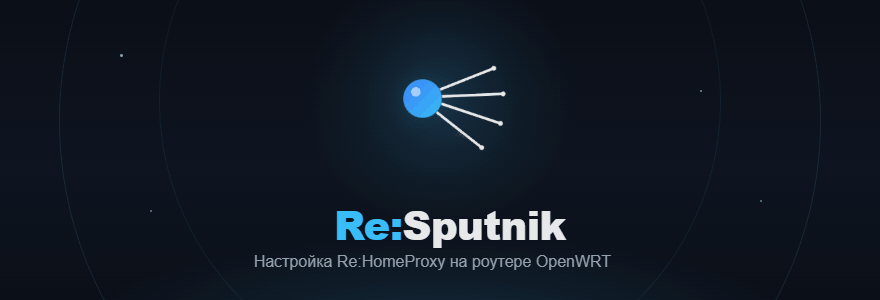

<p align="center">
  
</p>

<p align="center">
  <a href="https://t.me/one_andrevich"></a>
  <a href="https://ko-fi.com/D1D11SQNQD"></a>
  <a href="https://nowpayments.io/donation?api_key=decbeb76-30f8-4c6d-ba40-2d2dec7fd888"></a>
  <a href="LICENSE"></a>
</p>

# Re:Sputnik

**Русский** · [English](README.md) · [فارسی](README_fa.md) · [中文](README_cn.md)

**Десктоп-приложение, которое устанавливает и настраивает [Re:HomeProxy](https://github.com/1andrevich/homeproxy-hiddify) на роутере с OpenWrt — по SSH, без терминала и LuCI.**

Вы вводите адрес роутера и пароль; остальное приложение делает в графическом мастере:
устанавливает прокси-бэкенд и ядро, импортирует ваши серверы, настраивает маршрутизацию и
обход DPI, а затем позволяет управлять Wi-Fi, диагностикой и безопасностью.

> Re:Sputnik **не** включает в себя прокси-ядра — он ставит их на роутер из официальных
> источников и общается с роутером только по SSH/RPC (`ubus call luci.homeproxy.*`, `uci`,
> штатные скрипты пакета). По сути это универсальная платформа «установить и настроить ПО на
> OpenWrt»; Re:HomeProxy — лишь первый рецепт.

## Загрузка

Скачайте свежую сборку со страницы [**Releases**](https://github.com/1andrevich/re-sputnik/releases) — без установщика:

- **Windows** — `Re-Sputnik-windows-x64.exe`, двойной клик.
- **macOS** (Apple Silicon) — `Re-Sputnik-macos-arm64.dmg`, перетащите в Applications.
- **Linux** — `Re-Sputnik-linux-x86_64.AppImage` / `-aarch64.AppImage`, `chmod +x` и запустите.

Сборки пока **без подписи**: Windows SmartScreen предупредит (Подробнее → Выполнить в любом
случае); macOS Gatekeeper поместит приложение в карантин (правый клик → Открыть, или
`xattr -dr com.apple.quarantine`).

## Возможности

- **Установка** — определяет архитектуру роутера и пакетный менеджер (opkg/apk), ставит
  Re:HomeProxy и прокси-ядро (**hiddify-core** или **sing-box-extended**), может заранее скачать
  пакеты на ПК для роутеров в троттлящих/ограниченных сетях.
- **Серверы** — импорт подписок (sing-box/Hiddify JSON и Xray/V2Ray JSON), share-ссылок
  (VLESS/Reality, Hysteria2, Trojan, Shadowsocks…), `vpn://` и файлов `.conf`
  (WireGuard/AmneziaWG); пулы автоподбора по скорости (URLTest).
- **Маршрутизация** — готовые режимы (Россия / Китай / Иран / глобальный) на списках
  Re:filter и Russia Inside.
- **Обход DPI** — встроенные **ByeDPI** (47 пресетов) и **Zapret 2** (36 пресетов), плюс тестер
  стратегий, который параллельно проверяет несколько площадок и показывает, что реально работает
  у вашего провайдера.
- **Управление** — диагностика (статус ядра, DNS, маршруты), Wi-Fi / LAN / DHCP, пароли и
  SSH-ключи, резервные копии и обслуживание, SQM / UPnP.
- **Языки** — русский, английский, фарси, китайский. Несколько сохранённых профилей роутеров.

## Три способа входа

- **⚡ Пошаговый** — линейный мастер, который проводит нетехнического пользователя через
  интернет, установку, серверы и проверку.
- **⚙ Расширенный** — свободная навигация по разделам (Серверы, Правила, Диагностика, Anti-DPI,
  Ядро, Безопасность…) для ручного управления.
- **📦 Предустановка пакетов** — скачать на ПК и залить на роутер, чтобы установить без
  интернета на самом роутере.

Любой режим подхватывает текущую конфигурацию роутера, а не начинает с нуля.

## Архитектура (кратко)

```
UI (customtkinter)          экраны мастера и настроек; ведут процесс настройки
engine/*                    логика по функциям (установка, ноды, правила, ByeDPI, Zapret, диагностика…)
RouterClient (paramiko)     единственная дверь к роутеру: штатные скрипты, ubus, uci
Secrets (keyring)           учётные данные роутера в хранилище ключей ОС
```

Команды выполняются по очереди в рамках соединения, поэтому одновременные запросы не
обрываются SSH-демоном роутера. Телеметрии нет; учётные данные не покидают ваш компьютер.

## Технологии

Чистый Python + несколько библиотек — без web/HTML/CSS/JS:

| Слой | Библиотека |
|------|-----------|
| UI | customtkinter (Tk) |
| Связь с роутером | paramiko (SSH) |
| Секреты | keyring (хранилище ключей ОС) |
| Иконки | Lucide/Phosphor (UI) + Simple Icons (бренды), печёные SVG→PNG на сборке |

## Разработка

```sh
python -m venv .venv
. .venv/Scripts/activate      # Windows: .venv\Scripts\activate
pip install -e ".[dev]"
python -m re_sputnik
pytest -q                     # тесты + проверка компиляции
```

CI прогоняет тесты на каждый push ([`test.yml`](.github/workflows/test.yml)); сборки под все
платформы по запросу — в [`build.yml`](.github/workflows/build.yml); релизы по тегу (`vX.Y.Z`)
собирают все платформы и публикуются на странице Releases через
[`release.yml`](.github/workflows/release.yml). Порядок участия — в
[`CONTRIBUTING.md`](CONTRIBUTING.md) (Developer Certificate of Origin).

## О товарных знаках

Не аффилировано с YouTube, Telegram, Discord, Meta или Hiddify и не одобрено ими. Логотипы
сервисов — товарные знаки их владельцев, используются только для обозначения сервисов.

## Поддержать проект

Если Re:Sputnik вам полезен — помогает ⭐, либо поддержите разработку напрямую:

<a href="https://ko-fi.com/D1D11SQNQD" target="_blank"></a>
&nbsp;
<a href="https://nowpayments.io/donation?api_key=decbeb76-30f8-4c6d-ba40-2d2dec7fd888" target="_blank" rel="noreferrer noopener"></a>

Вопросы и обновления — [Telegram](https://t.me/one_andrevich).

## Лицензия

Re:Sputnik — **свободное ПО** под **GNU General Public License v3.0** (GPLv3): вы можете
использовать, изучать, изменять и распространять его на этих условиях. Полный текст — в
[`LICENSE`](LICENSE), сторонние атрибуции — в [`NOTICE`](NOTICE).

Re:Sputnik — отдельная программа от **Re:HomeProxy** (тоже под GPL): она общается с роутером по
SSH/RPC и не включает и не линкует исходники Re:HomeProxy. Все встроенные сторонние зависимости —
под пермиссивными или слабо-копилефтными лицензиями (MIT/BSD/HPND/MPL-2.0; paramiko под
LGPL-2.1), совместимыми с GPLv3. Вклад принимается по Developer Certificate of Origin — см.
[`CONTRIBUTING.md`](CONTRIBUTING.md).
